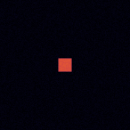
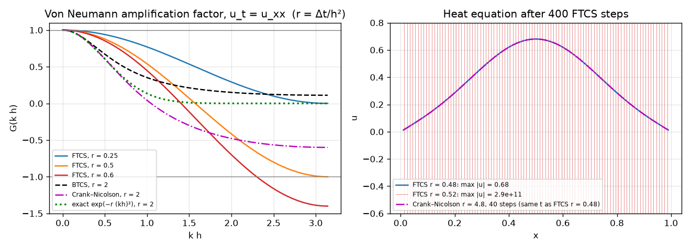
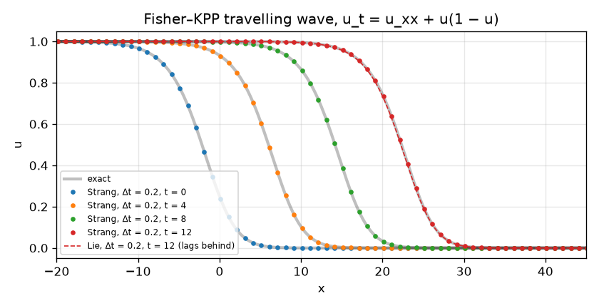
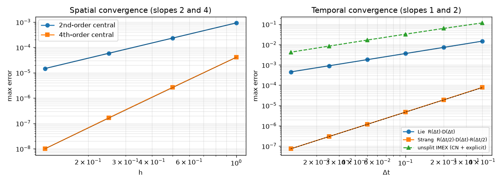
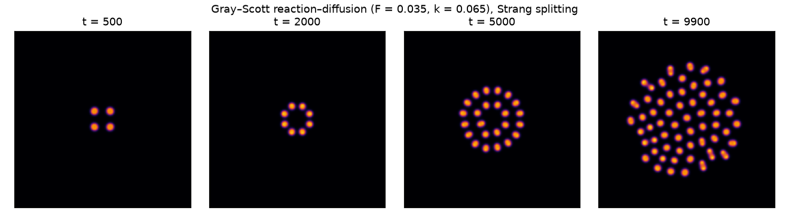

# Finite Differences and Operator Splitting

[](https://github.com/cfdgasman/fd-operator-splitting/actions/workflows/ci.yml)

Finite-difference schemes for parabolic equations and a careful comparison of **Lie** and **Strang** operator splitting. It is verified against an **exact travelling-wave solution** of the Fisher–KPP equation and finishes with a **Gray–Scott** pattern-formation simulation.

<p align="center"></p>

## 1. Spatial discretisation

On a uniform grid x<sub>i</sub> = x<sub>0</sub> + i h, the second derivative is replaced by central differences:

$$ \text{2nd order:}\quad (u_{xx})_i \approx \frac{u_{i-1} - 2u_i + u_{i+1}}{h^2} + \mathcal O(h^2) $$

$$ \text{4th order:}\quad (u_{xx})_i \approx \frac{-u_{i-2} + 16u_{i-1} - 30u_i + 16u_{i+1} - u_{i+2}}{12h^2} + \mathcal O(h^4) $$

Dirichlet data enter the rows next to the boundary as a known vector g(t), giving the semi-discrete system **u**′ = A**u** + **g**(t) + **R**(**u**).

## 2. Time discretisation and stability

The θ-method for **u**′ = A**u**:

$$ (I - \theta\Delta t A)\,\mathbf u^{n+1} = (I + (1-\theta)\Delta t A)\,\mathbf u^{n} $$

gives **FTCS** (θ = 0, explicit), **Crank–Nicolson** (θ = ½) and **BTCS** (θ = 1).

**Von Neumann analysis.** Substituting u<sub>j</sub><sup>n</sup> = G<sup>n</sup> e<sup>ikjh</sup> into the scheme for u<sub>t</sub> = u<sub>xx</sub>, with r = Δt/h², gives the amplification factor

$$ G(kh) = \frac{1 - 4(1-\theta)\, r \sin^2(kh/2)}{1 + 4\theta\, r\sin^2(kh/2)}. $$

This is the spectrum of the one-step matrix, since the eigenvalues of A are −4 sin²(kh/2)/h².
- **FTCS** is stable only for r ≤ ½.
- **BTCS** and **CN** are unconditionally stable.
- CN has **G → −1** for high wavenumbers when r is large, so sharp features decay slowly and oscillate. BTCS damps them, but is only first-order accurate.

<p align="center"></p>

## 3. Operator splitting

For u<sub>t</sub> = 𝒟u + ℛ(u) (diffusion + reaction), each sub-problem is advanced with its own best solver and the two are composed:

| Scheme | One step | Local error | Global order |
|---|---|---|---|
| **Lie** | e<sup>Δt𝒟</sup> ∘ e<sup>Δtℛ</sup> | ½Δt²[𝒟, ℛ] | 1 |
| **Strang** | e<sup>Δtℛ/2</sup> ∘ e<sup>Δt𝒟</sup> ∘ e<sup>Δtℛ/2</sup> | 𝒪(Δt³) (symmetric) | 2 |

The splitting error is set by the **commutator** [𝒟, ℛ]. When the operators commute, as with constant-coefficient advection and diffusion, both splittings are **exact**. The code checks this: the error is **1×10⁻¹⁵**.

In the Fisher–KPP test:
- **Reaction** ℛ(u) = u(1 − u) is solved *exactly*: e<sup>tℛ</sup>u = u eᵗ / (1 − u + u eᵗ).
- **Diffusion** is solved with **Crank–Nicolson** and the 4th-order stencil.
- The **unsplit IMEX** reference treats diffusion with CN and reaction with explicit Euler.

## Results

### Fisher–KPP:  u<sub>t</sub> = u<sub>xx</sub> + u(1 − u)

Exact travelling wave (Ablowitz & Zeppetella 1979), speed c = 5/√6:

$$ u(x,t) = \Big[1 + e^{(x - ct)/\sqrt 6}\Big]^{-2} $$

<p align="center"></p>
<p align="center"></p>

**Spatial** (max error, t = 2): observed order **2.00** (2nd-order stencil) and **4.06** (4th-order stencil).

**Temporal** (4th-order FD with 1601 points, t = 4):

| Δt | Lie | Strang | unsplit IMEX |
|---|---|---|---|
| 0.4 | 1.47e-02 | 7.77e-05 | 1.16e-01 |
| 0.2 | 7.30e-03 | 1.92e-05 | 6.28e-02 |
| 0.1 | 3.63e-03 | 4.78e-06 | 3.26e-02 |
| 0.05 | 1.81e-03 | 1.19e-06 | 1.67e-02 |
| 0.025 | 9.05e-04 | 2.98e-07 | 8.42e-03 |
| 0.0125 | 4.52e-04 | 7.38e-08 | 4.23e-03 |
| **order** | **1.00** | **2.01** | **0.99** |

At Δt = 0.4 Strang is **190×** more accurate than Lie, at the same cost: two consecutive half reaction steps merge into one. Lie splitting slows the wave down noticeably. Both split schemes beat the unsplit IMEX scheme, because the reaction step is solved exactly.

### Gray–Scott reaction–diffusion

$$ u_t = D_u\nabla^2 u - uv^2 + F(1-u), \qquad v_t = D_v\nabla^2 v + uv^2 - (F+k)v $$

The simulation uses a 200 × 200 periodic grid with the 5-point Laplacian and **Strang splitting**:
- **Diffusion half-steps** are solved *exactly* for the finite-difference operator in Fourier space, using the 5-point symbol −4[sin²(k<sub>x</sub>/2) + sin²(k<sub>y</sub>/2)].
- **Reaction steps** use classical RK4.

With F = 0.035 and k = 0.065, the seed splits into a self-replicating field of spots.

<p align="center"></p>

## Usage

```bash
pip install -r requirements.txt
python run.py     # tables + figures + GIF in docs/ (~2.5 min)
pytest
```

## References

M. J. Ablowitz, A. Zeppetella, *Explicit solutions of Fisher's equation for a special wave speed*, Bull. Math. Biol. 41 (1979) 835–840.
G. Strang, *On the construction and comparison of difference schemes*, SIAM J. Numer. Anal. 5 (1968) 506–517.
J. E. Pearson, *Complex patterns in a simple system*, Science 261 (1993) 189–192.

## License

MIT
